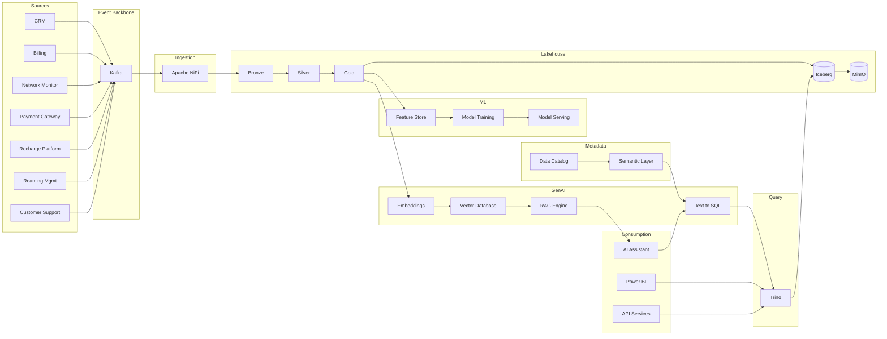

# Enterprise Data + AI Platform Architecture (DataMind AI)

## Project Overview
This repository contains **enterprise-grade architecture documentation** for a modern Data + AI platform designed for **millions of records/day** across multiple business domains:

- **Support Tickets** (customer support operations)
- **Payments** (financial transactions, fraud signals, settlement)
- **Telecom CDRs** (call detail records / network usage events)

The platform delivers:

- **Trusted analytics** (lakehouse + warehouse)
- **Operational reporting** and APIs
- **Machine learning** at scale (fraud, churn, classification, anomaly detection)
- **GenAI experiences** (Text-to-SQL, RAG, agentic workflows) with robust governance and security

## Architecture Summary
At a high level, the architecture implements a **lakehouse** pattern:


- **Source Systems**: 7 enterprise telecom applications (CRM, Billing, NMS, Payment Gateway, Recharge, Roaming, Customer Support) publishing events to Kafka
- **Ingestion**: Kafka → Apache NiFi → MinIO Iceberg Bronze layer
- **Data Lake**: MinIO (S3-compatible) + Iceberg tables organized into Bronze/Silver/Gold
- **Processing**: Spark for heavy transforms, streaming enrichment, and ML feature pipelines
- **Query/Serving**: Trino for federated lakehouse SQL, plus a recommended **warehouse** for high-concurrency BI and governed workloads
- **AI**: Feature store patterns, model training/serving, and GenAI services with validation/guardrails
- **Governance/Security**: centralized catalog, access controls, lineage, and auditability end-to-end


# DataMind AI

Enterprise Data + AI Platform for Telecom Analytics, Payments Intelligence, Operational Reporting, Machine Learning, RAG, and Text-to-SQL.

---

## Overview

DataMind AI is a modern enterprise-scale Data + AI platform designed to process millions of events per day across multiple telecom and business domains.

The platform combines real-time streaming, lakehouse architecture, analytics engineering, machine learning, and generative AI capabilities into a unified ecosystem.

DataMind AI demonstrates how a modern organization can transform raw operational events into trusted analytics, predictive intelligence, and AI-powered experiences.

---

## Business Domains

### Telecom Operations

* Call Detail Records (CDRs)
* SMS Events
* Data Usage Sessions
* Network Performance Metrics
* Roaming Events

### Financial Operations

* Payment Transactions
* Recharge Events
* Billing Analytics

### Customer Operations

* Customer Profiles
* Customer Registration Events
* Support Tickets
* Customer Complaints

---

## Architecture Highlights

### Source Systems

The platform simulates multiple enterprise systems:

* Customer Management System (CRM)
* Telecom Billing System
* Network Monitoring System
* Payment Gateway
* Recharge Platform
* Roaming Management System
* Customer Support System

Each system produces business events independently and publishes them to Kafka topics.

---

### Streaming & Ingestion

Technologies:

* Apache Kafka
* Apache NiFi

Responsibilities:

* Real-time event streaming
* Event routing
* Schema validation
* Data enrichment
* Data ingestion into Iceberg tables

---

### Lakehouse Architecture

Technologies:

* Apache Iceberg
* MinIO
* Project Nessie

Medallion Architecture:

```text
Bronze
  ↓
Silver
  ↓
Gold
```

#### Bronze Layer

Raw immutable event storage.

#### Silver Layer

Cleaned, validated, and enriched datasets.

#### Gold Layer

Business-ready datasets optimized for analytics and AI workloads.

---

### Data Processing

Technology:

* Apache Spark

Capabilities:

* Batch ETL
* Streaming ETL
* Data Quality Validation
* Feature Engineering
* KPI Generation
* Aggregations

---

### Query Layer

Technologies:

* Trino
* Semantic Layer

Capabilities:

* Federated SQL Queries
* Business Metrics
* KPI Definitions
* Self-Service Analytics

---

### Governance & Metadata

Technology:

* OpenMetadata

Capabilities:

* Data Catalog
* Data Lineage
* Business Glossary
* Data Ownership
* Impact Analysis

---

### Data Quality

Technology:

* Great Expectations

Capabilities:

* Data Validation
* Data Profiling
* Quality Monitoring
* SLA Enforcement

---

### Security

Features:

* RBAC
* Data Access Controls
* Audit Logging
* Encryption In Transit
* Encryption At Rest

---

## AI Platform

### Retrieval-Augmented Generation (RAG)

Knowledge Sources:

* Support Tickets
* Telecom Policies
* Product Documentation
* Operational Manuals

Architecture:

```text
Documents
    ↓
Embeddings
    ↓
Qdrant
    ↓
Retriever
    ↓
LLM
```

Capabilities:

* Knowledge Search
* Telecom Policy Assistant
* Support Knowledge Assistant

---

### Text-to-SQL

Natural language questions are automatically converted into SQL queries.

Architecture:

```text
User Question
      ↓
Semantic Layer
      ↓
LLM SQL Generator
      ↓
Trino
      ↓
Results
```

Examples:

* What is today's revenue?
* Which customers generated the highest roaming charges?
* Show monthly payment trends.

---

## Machine Learning Platform

Components:

* Feature Store
* Training Pipelines
* MLflow Registry
* Model Serving

Use Cases:

* Churn Prediction
* Fraud Detection
* Ticket Classification
* Customer Segmentation
* Network Anomaly Detection
* Revenue Forecasting

---

## End-to-End Data Flow

```text
Source Systems
      ↓
Kafka
      ↓
NiFi
      ↓
Bronze Iceberg
      ↓
Spark
      ↓
Silver Iceberg
      ↓
Spark
      ↓
Gold Iceberg
      ↓
Trino + Semantic Layer
      ↓
Power BI / APIs
      ↓
AI Applications
```

---

## Technology Stack

| Layer           | Technology         |
| --------------- | ------------------ |
| Orchestration   | Apache Airflow     |
| Streaming       | Apache Kafka       |
| Ingestion       | Apache NiFi        |
| Processing      | Apache Spark       |
| Lakehouse       | Apache Iceberg     |
| Storage         | MinIO              |
| Catalog         | Project Nessie     |
| Query Engine    | Trino              |
| Metadata        | OpenMetadata       |
| Data Quality    | Great Expectations |
| ML Platform     | MLflow             |
| Vector Database | Qdrant             |
| LLM Layer       | OpenAI / Ollama    |
| Language        | Python             |

---

## Key Features

* Enterprise Lakehouse Architecture
* Real-Time & Batch Processing
* Data Governance & Lineage
* AI-Powered Analytics
* Retrieval-Augmented Generation (RAG)
* Natural Language to SQL
* Machine Learning at Scale
* Multi-Domain Data Integration
* Scalable for Millions of Events per Day

---

## Project Status

Current Phase:

* Source Systems
* Kafka Streaming
* Lakehouse Foundation

Upcoming:

* Spark ETL Pipelines
* Trino Semantic Layer
* RAG Implementation
* Text-to-SQL Service
* ML Platform Integration

---

 

## Technology Stack
Primary recommended stack (with alternatives discussed in the docs):

- **Storage/Lakehouse**: MinIO (S3) + Apache Iceberg
- **Streaming**: Kafka
- **Orchestration**: Airflow
- **Compute**: Spark (batch + streaming)
- **Query Engine**: Trino (lakehouse SQL), plus a warehouse (see `08-data-warehouse-architecture.md`)
- **Catalog/Governance**: Iceberg catalog + data catalog (enterprise option), lineage, RBAC/ABAC
- **Observability**: metrics, logs, traces; data observability and SLAs/SLOs
- **ML/GenAI**: model registry, feature pipelines, LLM serving, vector database

## Data Flow Overview
End-to-end flow (conceptual):



