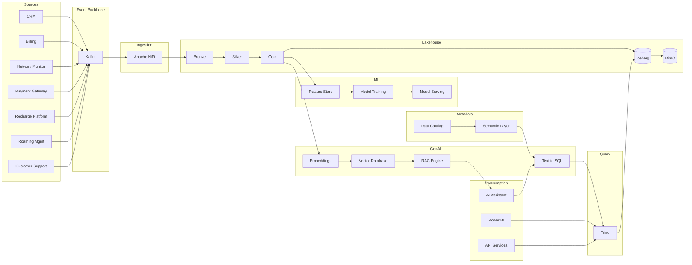

# Enterprise Data + AI Platform Architecture (DataMind AI)

## Project Overview
This repository contains **enterprise-grade architecture documentation** for a modern Data + AI platform designed for **millions of records/day** across multiple business domains:

- **Support Tickets** (customer support operations)
- **Payments** (financial transactions, fraud signals, settlement)
- **Telecom CDRs** (call detail records / network usage events)

The platform delivers:

- **Trusted analytics** (lakehouse + warehouse)
- **Operational reporting** and APIs
- **Machine learning** at scale (fraud, churn, classification, anomaly detection)
- **GenAI experiences** (Text-to-SQL, RAG, agentic workflows) with robust governance and security

## Architecture Summary
At a high level, the architecture implements a **lakehouse** pattern:

- **Source Systems**: 7 enterprise telecom applications (CRM, Billing, NMS, Payment Gateway, Recharge, Roaming, Customer Support) publishing events to Kafka
- **Ingestion**: Kafka → Apache NiFi → MinIO Iceberg Bronze layer
- **Data Lake**: MinIO (S3-compatible) + Iceberg tables organized into Bronze/Silver/Gold
- **Processing**: Spark for heavy transforms, streaming enrichment, and ML feature pipelines
- **Query/Serving**: Trino for federated lakehouse SQL, plus a recommended **warehouse** for high-concurrency BI and governed workloads
- **AI**: Feature store patterns, model training/serving, and GenAI services with validation/guardrails
- **Governance/Security**: centralized catalog, access controls, lineage, and auditability end-to-end

## Repository Structure
The documentation is organized as a numbered sequence:

- `01-03`: business context, requirements, source systems
- `4.x`: data ingestion (Kafka topics, NiFi to MinIO Iceberg pipeline)
- `05-14`: lake, processing, warehouse, modeling, CDC/streaming, quality, governance, security, observability
- `15-21`: ML, GenAI, Text-to-SQL, RAG, vector DB, semantic layer, API serving
- `22-27`: deployment, DR, cost, scaling, roadmap, and decision log

## Technology Stack
Primary recommended stack (with alternatives discussed in the docs):

- **Storage/Lakehouse**: MinIO (S3) + Apache Iceberg
- **Streaming**: Kafka
- **Orchestration**: Airflow
- **Compute**: Spark (batch + streaming)
- **Query Engine**: Trino (lakehouse SQL), plus a warehouse (see `08-data-warehouse-architecture.md`)
- **Catalog/Governance**: Iceberg catalog + data catalog (enterprise option), lineage, RBAC/ABAC
- **Observability**: metrics, logs, traces; data observability and SLAs/SLOs
- **ML/GenAI**: model registry, feature pipelines, LLM serving, vector database

## Data Flow Overview
End-to-end flow (conceptual):

