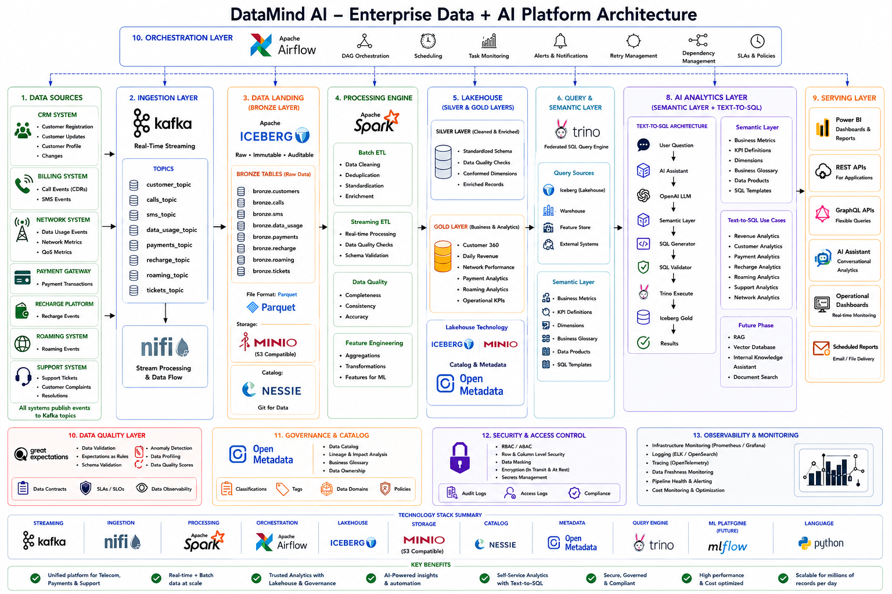
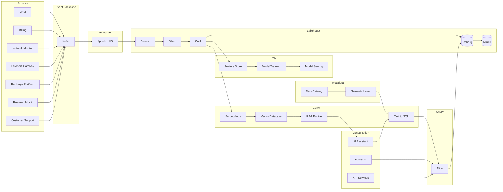

# Enterprise Data + AI Platform Architecture (DataMind AI)

## Project Overview
This repository contains **enterprise-grade architecture documentation** for a modern Data + AI platform designed for **millions of records/day** across multiple business domains:

- **Support Tickets** (customer support operations)
- **Payments** (financial transactions, fraud signals, settlement)
- **Telecom CDRs** (call detail records / network usage events)

The platform delivers:

- **Trusted analytics** (lakehouse + warehouse)
- **Operational reporting** and APIs
- **Machine learning** at scale (fraud, churn, classification, anomaly detection)
- **GenAI experiences** (Text-to-SQL, RAG, agentic workflows) with robust governance and security

## Architecture Summary
At a high level, the architecture implements a **lakehouse** pattern:



- **Source Systems**: 7 enterprise telecom applications (CRM, Billing, NMS, Payment Gateway, Recharge, Roaming, Customer Support) publishing events to Kafka
- **Ingestion**: Kafka → Apache NiFi → MinIO Iceberg Bronze layer
- **Data Lake**: MinIO (S3-compatible) + Iceberg tables organized into Bronze/Silver/Gold
- **Processing**: Spark for heavy transforms, streaming enrichment, and ML feature pipelines
- **Query/Serving**: Trino for federated lakehouse SQL, plus a recommended **warehouse** for high-concurrency BI and governed workloads
- **AI**: Feature store patterns, model training/serving, and GenAI services with validation/guardrails
- **Governance/Security**: centralized catalog, access controls, lineage, and auditability end-to-end

---

## Quick Start

Run the full local platform with Docker Compose — ingestion, lakehouse, processing, query, orchestration, governance, quality, ML, and AI layers.

### Prerequisites

- [Docker](https://docs.docker.com/get-docker/) and Docker Compose v2
- ~16 GB free RAM recommended for the **full** stack (OpenMetadata + Elasticsearch + NiFi + Spark)
- Ports available: `2181`, `3000`, `5000`, `6333`, `8080`–`8085`, `8090`, `8443`, `8585`, `8888`, `9000`, `9001`, `9092`, `10000`, `10001`, `11434`, `19120`

### 1. Start the stack

```bash
./scripts/up.sh
```

This starts all nine compose profiles:

| Profile | Services |
| ------- | -------- |
| `ingestion` | Kafka, Zookeeper, Schema Registry, Kafka UI, NiFi |
| `storage` | MinIO, Nessie, Iceberg REST |
| `processing` | Spark + Iceberg (Jupyter) |
| `query` | Trino |
| `orchestration` | Apache Airflow |
| `governance` | OpenMetadata |
| `quality` | Great Expectations gateway |
| `ml` | MLflow |
| `ai` | Qdrant + Ollama (local LLM) |

Start a subset if needed:

```bash
# Ingestion only (Kafka + NiFi)
docker compose --profile ingestion up -d

# Lakehouse + query
docker compose --profile storage --profile query up -d

# AI layer only
docker compose --profile ai up -d
```

Note: `ml` profile uses MinIO for artifacts — include `--profile storage` when starting MLflow alone.

### 2. Verify services

```bash
# Test whatever is currently running
./scripts/smoke-test.sh

# Require the full stack (all profiles)
./scripts/smoke-test.sh --strict

# Test a single profile
./scripts/smoke-test.sh --profile orchestration
./scripts/smoke-test.sh --profile governance
./scripts/smoke-test.sh --profile ai
```

Full test including Kafka event producers:

```bash
python3 -m venv .venv
.venv/bin/pip install -r source/requirements.txt
./scripts/smoke-test.sh --strict --with-producers
```

### 3. Publish sample telecom events

```bash
cd source
python -m runners.run_all --rate 20 --duration-seconds 60 --bootstrap-servers localhost:9092
```

Use `--clean` to disable intentional data-quality defects in generated events.

### 4. Stop the stack

```bash
./scripts/down.sh
```

### Local service URLs

| Service | URL | Notes |
| ------- | --- | ----- |
| Kafka | `localhost:9092` | Bootstrap for producers |
| Schema Registry | http://localhost:8081 | Avro schemas (future) |
| Kafka UI | http://localhost:8090 | Topic browser |
| NiFi | http://localhost:8082/nifi | `admin` / see `docker-compose.yml` |
| MinIO Console | http://localhost:9001 | `admin` / `password` |
| Nessie | http://localhost:19120 | Iceberg catalog API |
| Iceberg REST | http://localhost:8181 | PyIceberg / Spark catalog |
| Spark UI | http://localhost:8080 | — |
| Jupyter | http://localhost:8888 | No token (dev only) |
| Trino | http://localhost:8085 | Any username in CLI/UI |
| Airflow | http://localhost:8083 | `airflow` / `airflow` |
| OpenMetadata | http://localhost:8585 | `admin@open-metadata.org` / `admin` |
| GX Gateway | http://localhost:3000/health | Great Expectations |
| MLflow | http://localhost:5000 | Tracking server |
| Qdrant | http://localhost:6333 | Vector DB REST API |
| Ollama | http://localhost:11434 | Local LLM (pull models with `ollama pull`) |

Optional: copy `.env.example` to `.env` for local URL defaults.

### Repository layout

```text
DataMind-AI/
├── arch/                 # Architecture & data model docs
├── source/               # Python Kafka producer simulators (7 systems)
├── docker-compose.yml    # Local infra (9 profiles)
├── trino/                # Trino catalog & coordinator config
├── airflow/              # Airflow DAGs, logs, plugins
├── governance/           # OpenMetadata env config
├── services/gx-gateway/  # Great Expectations health API
├── scripts/              # up.sh, down.sh, smoke-test.sh, profiles.sh
└── init/setup.sql        # Initial lakehouse schemas
```

---

# DataMind AI

Enterprise Data + AI Platform for Telecom Analytics, Payments Intelligence, Operational Reporting, Machine Learning, RAG, and Text-to-SQL.

---

## Overview

DataMind AI is a modern enterprise-scale Data + AI platform designed to process millions of events per day across multiple telecom and business domains.

The platform combines real-time streaming, lakehouse architecture, analytics engineering, machine learning, and generative AI capabilities into a unified ecosystem.

A **runnable local stack** (Docker Compose) and **Python source simulators** are included so you can publish telecom events to Kafka and exercise MinIO, Nessie, Spark, and Trino on your machine. See [Quick Start](#quick-start) above.

---

## Business Domains

### Telecom Operations

* Call Detail Records (CDRs)
* SMS Events
* Data Usage Sessions
* Network Performance Metrics
* Roaming Events

### Financial Operations

* Payment Transactions
* Recharge Events
* Billing Analytics

### Customer Operations

* Customer Profiles
* Customer Registration Events
* Support Tickets
* Customer Complaints

---

## Architecture Highlights

### Source Systems

The platform simulates multiple enterprise systems:

* Customer Management System (CRM)
* Telecom Billing System
* Network Monitoring System
* Payment Gateway
* Recharge Platform
* Roaming Management System
* Customer Support System

Each system produces business events independently and publishes them to Kafka topics.

---

### Streaming & Ingestion

Technologies:

* Apache Kafka
* Confluent Schema Registry
* Apache NiFi

Responsibilities:

* Real-time event streaming
* Event routing
* Schema validation
* Data enrichment
* Data ingestion into Iceberg tables

---

### Lakehouse Architecture

Technologies:

* Apache Iceberg
* MinIO
* Project Nessie

Medallion Architecture:

```text
Bronze
  ↓
Silver
  ↓
Gold
```

#### Bronze Layer

Raw immutable event storage.

#### Silver Layer

Cleaned, validated, and enriched datasets.

#### Gold Layer

Business-ready datasets optimized for analytics and AI workloads.

---

### Data Processing

Technology:

* Apache Spark

Capabilities:

* Batch ETL
* Streaming ETL
* Data Quality Validation
* Feature Engineering
* KPI Generation
* Aggregations

---

### Query Layer

Technologies:

* Trino
* Semantic Layer

Capabilities:

* Federated SQL Queries
* Business Metrics
* KPI Definitions
* Self-Service Analytics

---

### Governance & Metadata

Technology:

* OpenMetadata

Capabilities:

* Data Catalog
* Data Lineage
* Business Glossary
* Data Ownership
* Impact Analysis

---

### Data Quality

Technology:

* Great Expectations

Capabilities:

* Data Validation
* Data Profiling
* Quality Monitoring
* SLA Enforcement

---

### Security

Features:

* RBAC
* Data Access Controls
* Audit Logging
* Encryption In Transit
* Encryption At Rest

---

## AI Platform

### Retrieval-Augmented Generation (RAG)

Knowledge Sources:

* Support Tickets
* Telecom Policies
* Product Documentation
* Operational Manuals

Architecture:

```text
Documents
    ↓
Embeddings
    ↓
Qdrant
    ↓
Retriever
    ↓
LLM
```

Capabilities:

* Knowledge Search
* Telecom Policy Assistant
* Support Knowledge Assistant

---

### Text-to-SQL

Natural language questions are automatically converted into SQL queries.

Architecture:

```text
User Question
      ↓
Semantic Layer
      ↓
LLM SQL Generator
      ↓
Trino
      ↓
Results
```

Examples:

* What is today's revenue?
* Which customers generated the highest roaming charges?
* Show monthly payment trends.

---

## Machine Learning Platform

Components:

* Feature Store
* Training Pipelines
* MLflow Registry
* Model Serving

Use Cases:

* Churn Prediction
* Fraud Detection
* Ticket Classification
* Customer Segmentation
* Network Anomaly Detection
* Revenue Forecasting

---

## End-to-End Data Flow

```text
Source Systems
      ↓
Kafka
      ↓
NiFi
      ↓
Bronze Iceberg
      ↓
Spark
      ↓
Silver Iceberg
      ↓
Spark
      ↓
Gold Iceberg
      ↓
Trino + Semantic Layer
      ↓
Power BI / APIs
      ↓
AI Applications
```

---

## Technology Stack

| Layer           | Technology         | Local stack |
| --------------- | ------------------ | ----------- |
| Orchestration   | Apache Airflow     | Yes         |
| Streaming       | Apache Kafka       | Yes         |
| Schema Registry | Confluent          | Yes         |
| Ingestion       | Apache NiFi        | Yes         |
| Processing      | Apache Spark       | Yes         |
| Lakehouse       | Apache Iceberg     | Yes         |
| Storage         | MinIO              | Yes         |
| Catalog         | Project Nessie     | Yes         |
| Query Engine    | Trino              | Yes         |
| Metadata        | OpenMetadata       | Yes         |
| Data Quality    | Great Expectations | Yes         |
| ML Platform     | MLflow             | Yes         |
| Vector Database | Qdrant             | Yes         |
| LLM Layer       | Ollama (local) / OpenAI (cloud) | Yes (Ollama) |
| Language        | Python             | Yes         |

---

## Key Features

* Enterprise Lakehouse Architecture
* Real-Time & Batch Processing
* Data Governance & Lineage
* AI-Powered Analytics
* Retrieval-Augmented Generation (RAG)
* Natural Language to SQL
* Machine Learning at Scale
* Multi-Domain Data Integration
* Scalable for Millions of Events per Day

---

## Project Status

**Current phase (implemented locally):**

* Source system simulators (`source/`) — 7 Kafka producers
* Docker Compose stack — all 9 profiles (ingestion → ai)
* Smoke tests with per-profile support (`scripts/smoke-test.sh`)
* Architecture & data model documentation (`arch/`)

**Upcoming:**

* NiFi flows (Kafka → Iceberg Bronze)
* Spark ETL pipelines (Bronze → Silver → Gold)
* Trino semantic layer
* RAG pipelines (Qdrant + Ollama embeddings)
* Text-to-SQL service
* OpenMetadata ingestion connectors (Trino, Kafka, etc.)

---

## Data Flow Overview

End-to-end flow (conceptual):



