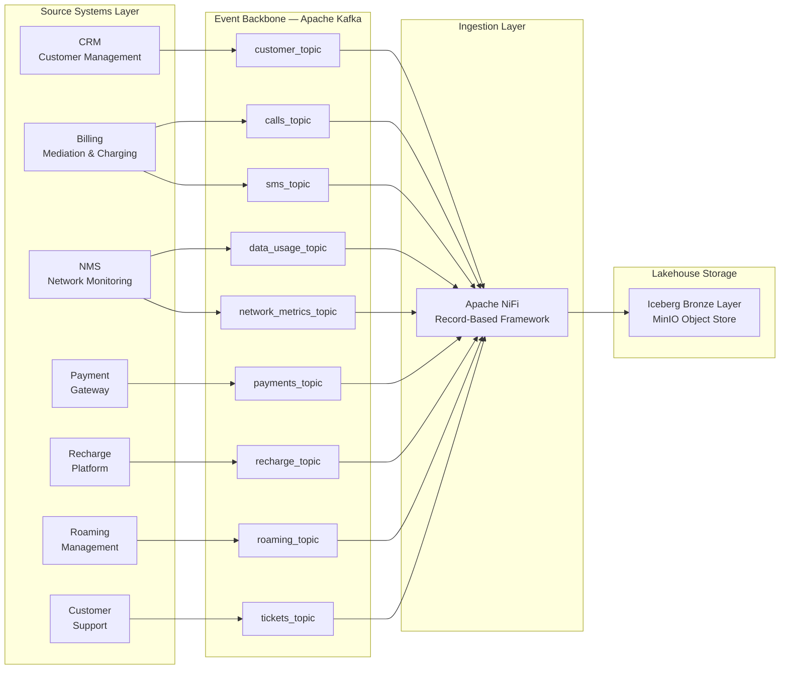

# 03 — Source Systems Layer

**Version**: 1.0.0 | **Last Updated**: 2026-06-14 | **Status**: Approved

---

## 1. Overview

The Source Systems layer represents all production-grade enterprise applications that generate telecom business events. Each system operates independently within the DataMind AI ecosystem, owns its data domain, and publishes events to the enterprise event backbone (Apache Kafka) in real time.

This layer simulates a live telecom environment processing **2–5 million events per day** across 7 operational systems.

### Source Systems Architecture Flow



### Implementation Mapping

Each source system has a dedicated Kafka producer in `source/`, matching the architecture:

| System | Directory | Producer Files | Topics |
|--------|-----------|---------------|--------|
| CRM | `source/crm_system/` | `producer.py` | `customer_topic` |
| Billing | `source/billing_system/` | `call_producer.py`, `sms_producer.py` | `calls_topic`, `sms_topic` |
| NMS | `source/network_system/` | `data_usage_producer.py`, `network_metrics_producer.py` | `data_usage_topic`, `network_metrics_topic` |
| Payment Gateway | `source/payment_gateway/` | `producer.py` | `payments_topic` |
| Recharge Platform | `source/recharge_platform/` | `producer.py` | `recharge_topic` |
| Roaming Management | `source/roaming_system/` | `producer.py` | `roaming_topic` |
| Customer Support | `source/support_system/` | `producer.py` | `tickets_topic` |

---

## 2. Source Systems

### 2.1 Customer Management System (CRM)

| Attribute | Detail |
|-----------|--------|
| System ID | `CRM-01` |
| Ownership | Customer Operations |
| Interface | REST API, Web UI |
| SLA | 99.95% availability |

**Responsibilities:**
- Customer registration and identity management
- Customer profile updates (demographics, preferences, plan changes)
- Customer lifecycle management (activation, suspension, termination)
- Customer segmentation and behavior profiling

**Event Types Produced:**

| Event | Schema Key | Description |
|-------|-----------|-------------|
| `customer_registration` | `cus_reg_v1` | New customer sign-up with demographic and plan data |
| `customer_profile_update` | `cus_prof_v1` | Changes to existing customer profile attributes |

**Kafka Topic:** `customer_topic` (partitions: 6, replication: 3)

---

### 2.2 Telecom Billing System (Mediation & Charging)

| Attribute | Detail |
|-----------|--------|
| System ID | `BIL-01` |
| Ownership | Finance / Revenue Assurance |
| Interface | Radius, Diameter, REST |
| SLA | 99.99% availability |

**Responsibilities:**
- Real-time call metering and charging
- SMS event logging and rating
- Usage-based charging for data sessions
- Invoice generation and bill cycle management

**Event Types Produced:**

| Event | Schema Key | Description |
|-------|-----------|-------------|
| `call_cdr` | `cdr_call_v2` | Call Detail Record with duration, status, QoS metrics, and charge |
| `sms_event` | `cdr_sms_v2` | SMS record with sender, receiver, status, and delivery path |

**Kafka Topics:**
- `calls_topic` (partitions: 12, replication: 3)
- `sms_topic` (partitions: 8, replication: 3)

---

### 2.3 Network Monitoring System (NMS)

| Attribute | Detail |
|-----------|--------|
| System ID | `NMS-01` |
| Ownership | Network Operations Center (NOC) |
| Interface | SNMP, NETCONF, gRPC streaming |
| SLA | 99.999% availability |

**Responsibilities:**
- Real-time network usage tracking per subscriber and cell site
- Quality of Service (QoS) monitoring (MOS, jitter, packet loss, throughput)
- Network performance metrics collection (RAN, core, transport)
- Congestion and anomaly detection

**Event Types Produced:**

| Event | Schema Key | Description |
|-------|-----------|-------------|
| `data_session_event` | `nms_data_v2` | Data session with usage, network type, session duration, and QoS |
| `network_metric` | `nms_metric_v1` | Aggregate network performance per cell site / region |
| `qos_report` | `nms_qos_v1` | Quality metrics including MOS score, jitter, latency, packet loss |

**Kafka Topics:**
- `data_usage_topic` (partitions: 10, replication: 3)
- `network_metrics_topic` (partitions: 6, replication: 3)

---

### 2.4 Payment Gateway

| Attribute | Detail |
|-----------|--------|
| System ID | `PAY-01` |
| Ownership | Finance |
| Interface | REST API, ISO 8583 |
| Compliance | PCI-DSS Level 1 |
| SLA | 99.99% availability |

**Responsibilities:**
- Payment processing across multiple methods (credit card, mobile wallet, bank transfer, cash)
- Invoice settlement and payment reconciliation
- Transaction lifecycle management (authorization, capture, refund, chargeback)
- Fraud detection integration

**Event Types Produced:**

| Event | Schema Key | Description |
|-------|-----------|-------------|
| `payment_event` | `pay_v1` | Payment transaction with amount, method, status, and invoice reference |

**Kafka Topic:** `payments_topic` (partitions: 8, replication: 3)

---

### 2.5 Recharge Platform

| Attribute | Detail |
|-----------|--------|
| System ID | `RCH-01` |
| Ownership | Digital Commerce |
| Interface | REST API, USSD, web portal |
| SLA | 99.95% availability |

**Responsibilities:**
- Prepaid balance recharge (voucher, electronic, bank transfer)
- Top-up management and promotions
- Balance validation and fraud checks
- Recharge history and reconciliation

**Event Types Produced:**

| Event | Schema Key | Description |
|-------|-----------|-------------|
| `recharge_event` | `rch_v1` | Recharge transaction with amount, balances before/after, method, and status |

**Kafka Topic:** `recharge_topic` (partitions: 6, replication: 3)

---

### 2.6 Roaming Management System

| Attribute | Detail |
|-----------|--------|
| System ID | `RMG-01` |
| Ownership | International Services |
| Interface | GRX/IPX, REST API, TAP3 |
| SLA | 99.95% availability |

**Responsibilities:**
- International roaming event tracking and mediation
- Roaming charging and settlement with partner operators
- Real-time roaming steering and policy enforcement
- Partner operator integration and data exchange

**Event Types Produced:**

| Event | Schema Key | Description |
|-------|-----------|-------------|
| `roaming_event` | `rmg_v1` | Roaming session with country, operator, service type, duration, usage, and charge |

**Kafka Topic:** `roaming_topic` (partitions: 6, replication: 3)

---

### 2.7 Customer Support System (CRM Support Module)

| Attribute | Detail |
|-----------|--------|
| System ID | `CSU-01` |
| Ownership | Customer Experience (CX) |
| Interface | Web UI, REST API, IVR integration |
| SLA | 99.9% availability |

**Responsibilities:**
- Support ticket creation, assignment, and lifecycle management
- Complaint handling and escalation management
- Resolution tracking and quality assurance
- Multi-channel support (phone, chat, email, store, social media, IVR)
- CSAT and NPS measurement

**Event Types Produced:**

| Event | Schema Key | Description |
|-------|-----------|-------------|
| `ticket_created` | `csu_ticket_v1` | New support ticket with channel, reason, and priority |
| `complaint_filed` | `csu_complaint_v1` | Customer complaint with category and severity |
| `ticket_resolved` | `csu_resolution_v1` | Resolution record with agent, resolution time, and satisfaction score |

**Kafka Topic:** `tickets_topic` (partitions: 8, replication: 3)

---

## 3. Event Schema Governance

All events are serialized as **Avro** with schema validation enforced by **Schema Registry**:

| Registry | Endpoint |
|----------|----------|
| Schema Registry URL | `http://schema-registry.datamind.ai:8081` |
| Compatibility | `BACKWARD` |
| Evolution Policy | Additive changes only (optional fields) |

---

## 4. Kafka Topic Map

| Topic | Partitions | Replication | Retention | Source System | Event Types |
|-------|-----------|-------------|-----------|---------------|-------------|
| `customer_topic` | 6 | 3 | 90 days | CRM | `customer_registration`, `customer_profile_update` |
| `calls_topic` | 12 | 3 | 30 days | Billing | `call_cdr` |
| `sms_topic` | 8 | 3 | 30 days | Billing | `sms_event` |
| `data_usage_topic` | 10 | 3 | 30 days | NMS | `data_session_event` |
| `network_metrics_topic` | 6 | 3 | 7 days | NMS | `network_metric`, `qos_report` |
| `payments_topic` | 8 | 3 | 90 days | Payment Gateway | `payment_event` |
| `recharge_topic` | 6 | 3 | 90 days | Recharge Platform | `recharge_event` |
| `roaming_topic` | 6 | 3 | 90 days | Roaming Management | `roaming_event` |
| `tickets_topic` | 8 | 3 | 180 days | Customer Support | `ticket_created`, `complaint_filed`, `ticket_resolved` |

**Total partitions:** 70 | **Total throughput:** ~8,000 events/sec peak

---

## 5. Data Flow

### Detailed Pipeline View

```mermaid
flowchart TB
    subgraph SRC["Source Systems"]
        CRM2[CRM System]
        BIL2[Billing System]
        NMS2[Network Monitoring]
        PAY2[Payment Gateway]
        RCH2[Recharge Platform]
        RMG2[Roaming Management]
        CSU2[Customer Support]
    end

    subgraph KAFKA2["Apache Kafka — 9 Topics"]
        T1["customer_topic<br/><i>partitions: 6</i>"]
        T2["calls_topic<br/><i>partitions: 12</i>"]
        T3["sms_topic<br/><i>partitions: 8</i>"]
        T4["data_usage_topic<br/><i>partitions: 10</i>"]
        T5["network_metrics_topic<br/><i>partitions: 6</i>"]
        T6["payments_topic<br/><i>partitions: 8</i>"]
        T7["recharge_topic<br/><i>partitions: 6</i>"]
        T8["roaming_topic<br/><i>partitions: 6</i>"]
        T9["tickets_topic<br/><i>partitions: 8</i>"]
    end

    subgraph NIFI2["Apache NiFi Ingestion Pipeline"]
        CONSUME["ConsumeKafka_2_6<br/>Continuous Poll"]
        ATTR["UpdateAttribute<br/>Extract Metadata"]
        MERGE["MergeContent / ConvertRecord<br/>Avro ➔ Parquet"]
        S3OUT["PutS3Object<br/>MinIO S3 Endpoint"]
    end

    subgraph BRONZE["Iceberg Bronze Layer — MinIO"]
        B1["bronze.customers/<br/>year=.../month=.../day=.../"]
        B2["bronze.calls/<br/>year=.../month=.../day=.../"]
        B3["bronze.sms/<br/>year=.../month=.../day=.../"]
        B4["bronze.data_usage/<br/>year=.../month=.../day=.../"]
        B5["bronze.network_metrics/<br/>year=.../month=.../day=.../"]
        B6["bronze.payments/<br/>year=.../month=.../day=.../"]
        B7["bronze.recharge/<br/>year=.../month=.../day=.../"]
        B8["bronze.roaming/<br/>year=.../month=.../day=.../"]
        B9["bronze.tickets/<br/>year=.../month=.../day=.../"]
    end

    SRC --> KAFKA2
    KAFKA2 --> CONSUME
    CONSUME --> ATTR --> MERGE --> S3OUT
    S3OUT --> BRONZE
```



### ASCII Flow

### Flow Steps

1. **Production**: Each source system generates business events as part of normal operations (call completion, payment processing, ticket creation, etc.).

2. **Publication**: Systems publish events to their designated Kafka topics using Avro serialization. Producers use idempotent delivery with `acks=all`.

3. **Buffering**: Kafka retains events per the retention policy defined in the topic map. Consumer groups track offset positions for replayability.

4. **Ingestion**: Apache NiFi consumes events from all Kafka topics using `ConsumeKafka` processors, applies light envelope transformations (adds `ingest_ts_utc`, `batch_id`, `source_file`, `raw_record_hash`), and writes to Iceberg tables in the Bronze layer.

5. **Lakehouse Storage**: Iceberg tables are stored on MinIO (S3-compatible object storage) with Hive-style partitioning by `event_date`.

---

## 6. Operational Characteristics

| Metric | Value |
|--------|-------|
| Daily event volume | 2,000,000 – 5,000,000 events |
| Peak throughput | 8,000 events/sec |
| Average event size | 1.2 KB (Avro) |
| Daily data volume | ~5 GB raw |
| End-to-end latency (P99) | < 500 ms (source → Bronze) |
| Message durability | `acks=all`, min.insync.replicas=2 |
| Schema evolution | BACKWARD compatible via Schema Registry |

---

## 7. Diagram Structure (Draw.io / Excalidraw / Figma)

The following box-and-line layout is recommended for visual representation:

### Layer Placement

```
Top Row:     [CRM] [Billing] [NMS] [Payment Gateway] [Recharge Platform] [Roaming Mgmt] [Customer Support]
Middle Row:  [Apache Kafka — 9 Topics]
Bottom Row:  [Apache NiFi]
Bottom Layer:[Iceberg Lakehouse — Bronze Layer]
```

### Visual Conventions

| Element | Style |
|---------|-------|
| Source Systems | Rounded rectangle, light blue fill, dark border |
| Kafka | Horizontal bar spanning full width, orange/red theme |
| Topics | Small pill-shaped boxes below Kafka bar |
| NiFi | Rounded rectangle, dark blue fill, white text |
| Iceberg Lakehouse | Large rectangle at bottom, iceberg blue |

### Arrows

- Source System → Kafka Topic: solid line, arrowhead, labeled with event type name
- Kafka Topic → NiFi: solid line, arrowhead, labeled "ConsumeKafka → Iceberg"
- NiFi → Iceberg: dashed line, arrowhead, labeled "Parquet + Hive partition"

### Export Suggestion

Export the diagram as **SVG** and link it in this document for documentation portals.

---

## 8. Related Documents

| Document | Link |
|----------|------|
| Business Context | `01-business-context.md` |
| Requirements | `02-requirements.md` |
| Kafka Ingestion Details | `4.1 Data Ingestion Phase.md` |
| NiFi to MinIO Pipeline | `4.2 NIFI To MinIO.md` |
| Data Model | `../data-model.md` |
