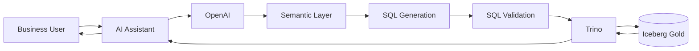
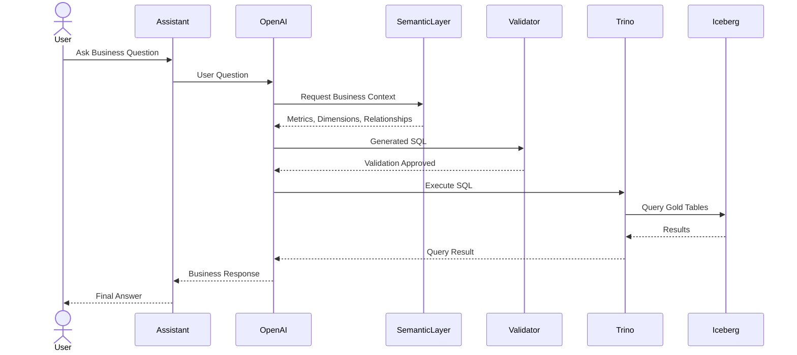
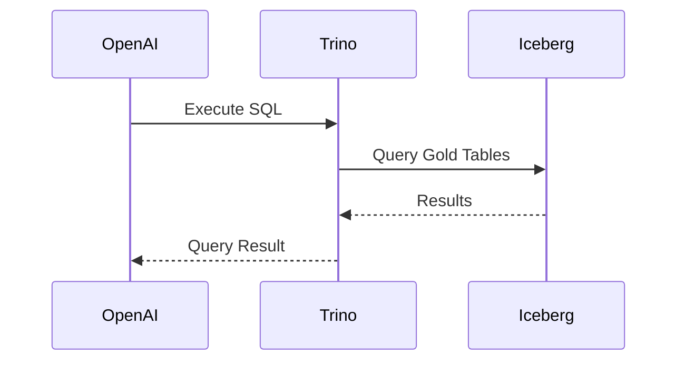

# Text-to-SQL Architecture

## Overview

The Text-to-SQL layer enables business users to interact with enterprise telecom data using natural language.

Instead of writing SQL queries manually, users can ask business questions and receive answers generated from trusted Gold Layer datasets.

Examples:

* What was the total revenue last month?
* Show the top 10 customers by revenue.
* Which region generated the highest roaming revenue?
* What is the payment success rate this week?

---

## Architecture



---

## End-to-End Query Flow



---

## Semantic Layer Role

The Semantic Layer provides business definitions to improve SQL generation accuracy.

Examples:

### Metrics

* Revenue
* ARPU
* Active Customers
* Payment Success Rate
* Average Recharge Amount

### Dimensions

* Customer
* Region
* City
* Country
* Date
* Payment Method

### Entities

* Customer
* Payment
* Recharge
* Roaming Event
* Support Ticket

The Semantic Layer acts as the business knowledge layer between the LLM and enterprise data.

---

## SQL Validation Layer

Generated SQL must be validated before execution.

Allowed:

```sql
SELECT
```

Blocked:

```sql
INSERT
UPDATE
DELETE
DROP
ALTER
TRUNCATE
```

The platform is strictly read-only.

---

## Trino Role

Trino is the execution engine for Text-to-SQL.

Responsibilities:

* Execute generated SQL
* Query Iceberg Gold tables
* Enforce access controls
* Return query results

Trino does not perform:

* ETL
* Data ingestion
* Data transformation
* Streaming processing

---

## Gold Layer Datasets

Text-to-SQL operates only on curated Gold datasets.

Available datasets:

* gold.customer_360
* gold.daily_revenue
* gold.customer_usage_daily
* gold.payment_analytics
* gold.recharge_analytics
* gold.roaming_analytics
* gold.network_performance
* gold.support_analytics
* gold.fraud_monitoring

---

## Example Query

### User Question

What was the total roaming revenue last month?

### Semantic Context

```yaml
metric:
  roaming_revenue

table:
  gold.roaming_analytics

column:
  total_roaming_charges
```

### Generated SQL

```sql
SELECT
    SUM(total_roaming_charges) AS roaming_revenue
FROM gold.roaming_analytics;
```

### Execution



---

## Future Roadmap

Current Scope:

1. Iceberg Gold Layer
2. Trino
3. Semantic Layer
4. OpenAI
5. Text-to-SQL

Future Enhancements:

* Conversational Analytics
* Dashboard Generation
* Automated Insights
* RAG Architecture (Phase 2)
* AI Analytics Assistant

---

## Summary

The Text-to-SQL architecture enables business users to access telecom analytics through natural language.

The solution combines:

* OpenAI
* Semantic Layer
* SQL Validation
* Trino
* Iceberg Gold

to provide secure, governed, and business-friendly access to enterprise data.
