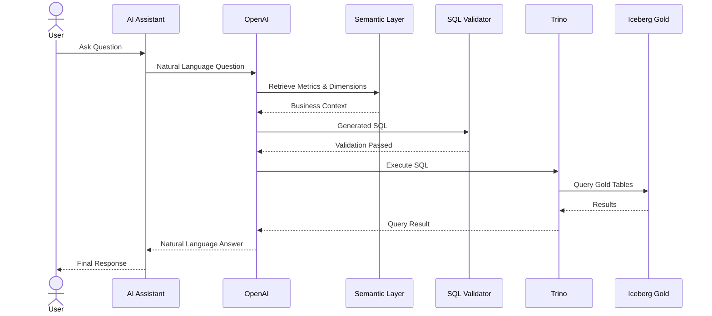
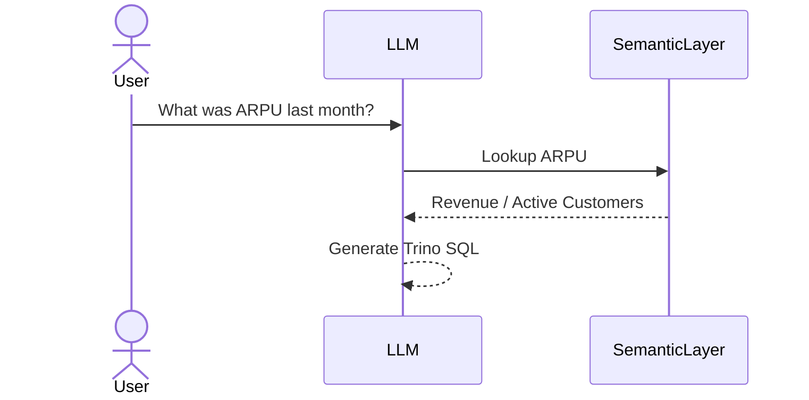
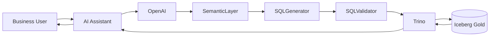

# Text-to-SQL Architecture

# Overview

Text-to-SQL is one of the core AI capabilities of DataMind AI.

It enables business users to ask questions using natural language and receive answers directly from enterprise data without writing SQL.

Example:

```text
What was the total roaming revenue last month?
```

The platform automatically:

1. Understands the question
2. Maps business terms to enterprise metrics
3. Generates SQL
4. Executes SQL through Trino
5. Returns the result

---

# Business Value

Text-to-SQL allows:

* Self-service analytics
* Faster business insights
* Reduced dependency on analysts
* Natural language interaction with enterprise data
* AI-powered reporting

---

# High-Level Architecture




---

# Core Components

## User Interface

Users interact using natural language.

Examples:

```text
What is today's revenue?

Show top 10 customers by revenue.

Which roaming country generated the highest revenue?

How many complaints were filed this month?
```

---

## OpenAI LLM

Responsible for:

* Understanding intent
* Identifying business entities
* Mapping metrics
* Generating SQL

The LLM never accesses the database directly.

---

## Semantic Layer

Provides business context.

Examples:

```yaml
Revenue:
  table: gold.daily_revenue
  metric: total_revenue

ARPU:
  formula:
    revenue / active_customers

Customer:
  table: gold.customer_360
```

The Semantic Layer helps the LLM understand:

* Business definitions
* Available metrics
* Relationships
* Dimensions

---

## SQL Generator



Converts user intent into executable SQL.

Example:

Question:

```text
Top 10 customers by revenue
```

Generated SQL:

```sql
SELECT
    customer_id,
    total_revenue
FROM gold.customer_360
ORDER BY total_revenue DESC
LIMIT 10;
```

---

## Query Validator

Before execution, generated SQL is validated.

Checks include:

* Allowed schemas
* Allowed tables
* Allowed columns
* SQL syntax validation
* Query complexity limits

Example:

Allowed:

```sql
SELECT *
FROM gold.customer_360;
```

Blocked:

```sql
DROP TABLE gold.customer_360;
```

---

## Trino

Trino executes generated SQL against Iceberg Gold tables.

Responsibilities:

* Query execution
* Optimization
* Security enforcement
* Result retrieval

---

## Iceberg Gold Layer

Trusted analytics-ready datasets.

Examples:

```text
gold.customer_360

gold.daily_revenue

gold.customer_usage_daily

gold.payment_analytics

gold.recharge_analytics

gold.roaming_analytics

gold.network_performance

gold.support_analytics

gold.fraud_monitoring
```

---

# Query Flow

## Example Question



```text
What was the roaming revenue last month?
```

---

## Step 1

User submits question.

```text
Question
    │
    ▼

What was the roaming revenue last month?
```

---

## Step 2

OpenAI identifies:

```yaml
intent: revenue_analysis

metric:
  roaming_revenue

time_period:
  last_month
```

---

## Step 3

Semantic Layer provides:

```yaml
metric:
  roaming_revenue

table:
  gold.roaming_analytics

column:
  total_roaming_charges
```

---

## Step 4

SQL is generated.

```sql
SELECT
SUM(total_roaming_charges)
AS roaming_revenue
FROM gold.roaming_analytics
WHERE month(roaming_date)=5;
```

---

## Step 5

SQL Validator approves query.

---

## Step 6

Trino executes query.

```text
Trino
  │
  ▼

Iceberg Gold
```

---

## Step 7

Results returned.

```json
{
  "roaming_revenue": 1245000
}
```

---

## Step 8

OpenAI converts result into business language.

Example:

```text
Total roaming revenue last month was $1.24 million.
```

---

# Security Model

The AI layer never receives:

* Database credentials
* Storage credentials
* Direct Iceberg access

Only Trino can access Gold datasets.

Architecture:

```text
User
 │
 ▼

OpenAI
 │
 ▼

Trino
 │
 ▼

Iceberg
```

Benefits:

* Better governance
* Centralized access control
* Query auditing

---

# Supported Question Types

## Revenue Analysis

Examples:

```text
Revenue by month

Revenue by region

Revenue trend

Top revenue sources
```

---

## Customer Analytics

Examples:

```text
Top customers

Customer growth

Customer segmentation

Customer lifetime value
```

---

## Usage Analytics

Examples:

```text
Most active users

Data usage trends

Average session duration

SMS volume
```

---

## Payment Analytics

Examples:

```text
Payment success rate

Top payment methods

Failed payments

Daily payment volume
```

---

## Network Analytics

Examples:

```text
Network health score

Packet loss trend

Latency by region

Throughput analysis
```

---

## Support Analytics

Examples:

```text
Ticket volume

Complaint categories

Resolution time

Customer satisfaction
```

---

# SQL Safety Controls

Allowed Operations:

```text
SELECT
```

Restricted Operations:

```text
INSERT

UPDATE

DELETE

DROP

ALTER

TRUNCATE
```

The Text-to-SQL system is read-only.

---

# Prompt Engineering Strategy

The LLM receives:

## User Question

```text
What was the ARPU last month?
```

## Semantic Context

```yaml
Metric:
  ARPU

Formula:
  Revenue / Active Customers
```

## Available Tables

```text
gold.customer_360
gold.daily_revenue
gold.customer_usage_daily
```

## Instructions

```text
Generate valid Trino SQL only.
Use Gold tables only.
Return a single SQL statement.
```

---

# Future Enhancements

## Conversational Analytics

Example:

```text
User:
Show top 10 customers.

User:
Only from Cairo.

User:
Compare with last month.
```

The assistant maintains context across questions.

---

## Chart Generation

Example:

```text
Show monthly revenue trend.
```

Output:

```text
SQL Result
    │
    ▼

Visualization Layer
    │
    ▼

Chart
```

---

## Agentic Analytics

Future capability:

```text
Question
   │
   ▼

Planner Agent
   │

 ┌─┴───────────┐
 │             │

SQL Agent   RAG Agent
 │             │

Trino      Vector DB
 │             │

Results    Context
 │             │
 └─────┬───────┘
       ▼

Final Answer
```

---

# Relationship with RAG

Text-to-SQL is used when answers exist inside structured data.

Example:

```text
What was revenue last month?
```

Source:

```text
Gold Tables
```

---

RAG is used when answers exist inside documents.

Example:

```text
How is churn score calculated?
```

Source:

```text
Policies
Documentation
Runbooks
Business Definitions
```

---

# Summary

Text-to-SQL is the AI analytics layer of DataMind AI.

It enables users to query enterprise telecom data using natural language.

The architecture combines:

* OpenAI
* Semantic Layer
* SQL Validation
* Trino
* Iceberg Gold

to deliver secure, governed, and business-friendly analytics at scale.
