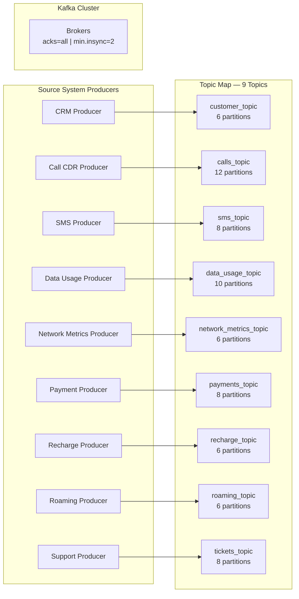

# Data Ingestion Phase: Apache Kafka Architecture

This document outlines the detailed technical specifications for the initial ingestion phase of the **DataMind AI Platform**, focusing on how external source systems publish events to **Apache Kafka** and defining the precise Topic strategy.

---

## 1. How Data Enters Apache Kafka (The Ingestion Mechanism)

Apache Kafka acts as the decoupled, highly-available, and fault-tolerant event backbone for the entire enterprise. Source systems do not write directly to storage; instead, they stream events in real-time to Kafka.

### Ingestion Methods by System Type:
1. **Application Services (CRM, Billing, Payment Gateway, Support):**
   * These systems use official **Kafka Producer SDKs** (built into Java/Python/Go applications) or **REST Proxies** to push JSON/Avro events immediately after an action occurs (e.g., a customer clicks "Pay").
2. **Infrastructure & Network Elements (Network System, Roaming System):**
   * High-throughput network nodes dump raw metrics and logs using lightweight agents like **Fluentbit**, **Logstash**, or custom syslog daemons configured to route data directly to Kafka brokers.

---

## 2. Kafka Topics Design & Topography

Based on the core operational data domains outlined in the architecture, we implement a **Single-Entity-Type-Per-Topic** strategy. This ensures strict ordering per entity, makes security/access control easier, and cleanly isolates domain failures.

We will provision exactly **9 Core Topics**:

| # | Topic Name | Source System | Payload Description | Keying Strategy (`Kafka Key`) |
|---|------------|---------------|---------------------|-------------------------------|
| **1** | `customer_topic` | CRM System | Customer Registration, Profile Updates, Consent changes. | `customer_id` |
| **2** | `calls_topic` | Billing System | Call Detail Records (CDRs), duration, cell towers, call drops. | `calling_number` |
| **3** | `sms_topic` | Billing System | SMS event details, timestamps, delivery receipts, routing info. | `sender_number` |
| **4** | `data_usage_topic` | Network System | Real-time internet/data sessions, bytes consumed, QoS Metrics. | `imsi_or_device_id` |
| **5** | `network_metrics_topic` | Network System | Aggregate network KPIs, cell site load, MOS scores, throughput. | `cell_site_id` |
| **6** | `payments_topic` | Payment Gateway | Financial transactions, gateway responses, success/fail tokens. | `transaction_id` |
| **7** | `recharge_topic` | Recharge Platform | Wallet top-ups, scratch card activations, digital balance updates.| `customer_id` |
| **8** | `roaming_topic` | Roaming System | Inter-carrier handshakes, foreign network attachments, country codes.| `imsi_or_device_id` |
| **9** | `tickets_topic` | Support System | Customer complaints, support tickets, chat logs, SLA resolution times.| `ticket_id` |

---
