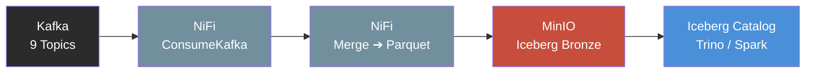
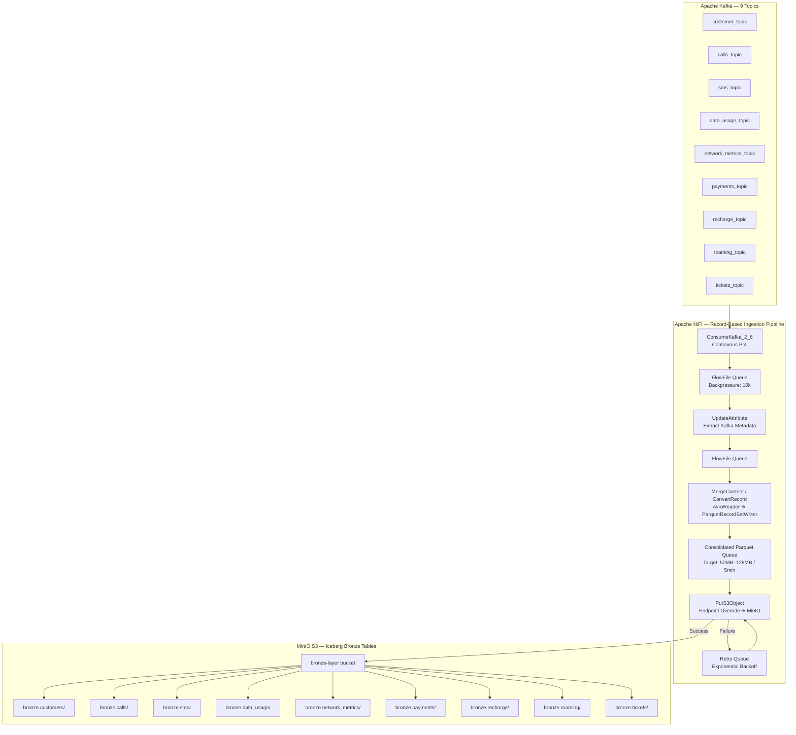

# Data Ingestion Phase: Apache NiFi to MinIO (Bronze Layer)



This document outlines the technical implementation details of how **Apache NiFi** consumes real-time event streams from **Apache Kafka**, bundles them efficiently to avoid the "Small File Problem", and writes them securely into **MinIO S3 Object Storage** under the **Apache Iceberg (Bronze Layer)** structure.

---

## 1. Architectural Overview & Data Flow

Apache NiFi acts as the data orchestrator, transforming real-time, event-driven streams from Kafka into structural micro-batches optimal for modern data lakehouses.



---

## 2. NiFi Processing Pipeline (Step-by-Step)

To ingest data cleanly and optimally into MinIO, a dedicated NiFi Process Group is constructed for each data domain using a **Record-Based Framework**. Below is the precise pipeline sequence:

```
[ConsumeKafka_2_6] ──> [UpdateAttribute] ──> [MergeContent / ConvertRecord] ──> [PutS3Object]
```

### Step 1: ConsumeKafka_2_6
* **Function:** Continuously polls events from a designated Kafka topic (e.g., `calls_topic`).
* **Key Configuration:**
  * **Kafka Brokers:** `kafka-broker-1:9092,kafka-broker-2:9092`
  * **Topic Name(s):** `${topic.name}` (Dynamic or static per processor)
  * **Group ID:** `nifi-bronze-ingestion-group`
  * **Honor Transactions:** `true` (Ensures exactly-once/at-least-once compliance)

### Step 2: UpdateAttribute (Metadata Extraction)
* **Function:** Extracts the Kafka metadata attributes (Topic name, Partition, Offset) and injects targeted routing attributes used to build the MinIO S3 folder paths dynamically.
* **Attributes Added:**
  * `s3.bucket` = `bronze-layer`
  * `s3.path` = `landing/${kafka.topic}/year=${now():format('yyyy')}/month=${now():format('MM')}/day=${now():format('dd')}/`

### Step 3: Record Consolidation & Micro-Batching (Mitigating Small Files)
To prevent creating millions of tiny files in MinIO (which degrades Apache Spark/Trino reading performance), NiFi buffers and merges streaming records into large, structurally clean files using **`MergeContent`** or record-based writers.
* **Batching Threshold Rules (Whichever met first):**
  * **Minimum Group Size:** `50 MB` to `128 MB`
  * **Max Bin Age:** `5 mins` (Ensures data freshness; forces write even if 50MB isn't reached)
* **Format Transformation:** Leverages an `AvroReader` to parse incoming streams and a `ParquetRecordSetWriter` to convert the data directly into compressed columnar **Parquet** files before landing.

### Step 4: PutS3Object (Writing to MinIO)
* **Function:** Streams the consolidated Parquet file directly into the S3-compatible MinIO storage layer using AWS S3 APIs.
* **Key Configuration:**
  * **Access Key / Secret Key:** Credentials provisioned securely via HashiCorp Vault or NiFi Controller Services.
  * **Endpoint Override URL:** `http://minio-oss-server:9000` (Directing traffic to local MinIO instead of AWS)
  * **Bucket:** `${s3.bucket}`
  * **Object Key:** `${s3.path}${hostname()}_${now():toNumber()}.parquet`

---

## 3. MinIO Target Folder Structure (Bronze Layout)

When NiFi pushes the data, it lands in a strict, partition-aware directory structure layout that aligns with **Apache Iceberg's** catalog expectations:

```
bronze-layer/
├── bronze.customers/
│   └── year=2026/month=06/day=14/
│       └── customer_events_10293.parquet
├── bronze.calls/
│   └── year=2026/month=06/day=14/
│       └── network_calls_88291.parquet
├── bronze.sms/
│   └── year=2026/month=06/day=14/
│       └── sms_events_47382.parquet
├── bronze.data_usage/
│   └── year=2026/month=06/day=14/
│       └── data_sessions_23741.parquet
├── bronze.network_metrics/
│   └── year=2026/month=06/day=14/
│       └── nms_metrics_55102.parquet
├── bronze.payments/
│   └── year=2026/month=06/day=14/
│       └── payment_txns_66481.parquet
├── bronze.recharge/
│   └── year=2026/month=06/day=14/
│       └── recharge_events_33927.parquet
├── bronze.roaming/
│   └── year=2026/month=06/day=14/
│       └── roaming_sessions_44816.parquet
└── bronze.tickets/
    └── year=2026/month=06/day=14/
        └── support_tickets_11029.parquet
```

---

## 4. Reliability & Production Failover Settings

To guarantee zero data loss inside Apache NiFi during network cuts or MinIO downtime, the following production configurations are mandatory:

1. **Backpressure Object Threshold:** Set to `10000` objects on the connection queue leading to `PutS3Object`. If MinIO slows down, NiFi halts pulling from Kafka automatically, keeping the data safely back-logged in Kafka's immutable partitions.
2. **NiFi Cluster FlowFile Repository:** Backed by high-performance local NVMe SSD storage. If a physical NiFi node loses power mid-flight, state is restored instantly without losing any uncommitted data packets.
3. **Failure Queuing:** If `PutS3Object` throws a `503 Slow Down` or network timeout error, the flow routes messages to a **Retry Queue** with an exponential back-off penalty before routing to a Dead Letter Queue (DLQ) for alerting via Prometheus/Grafana.