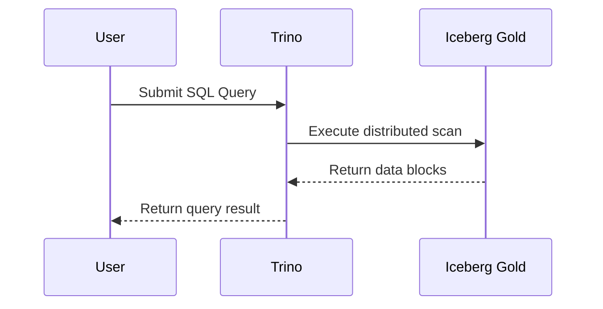
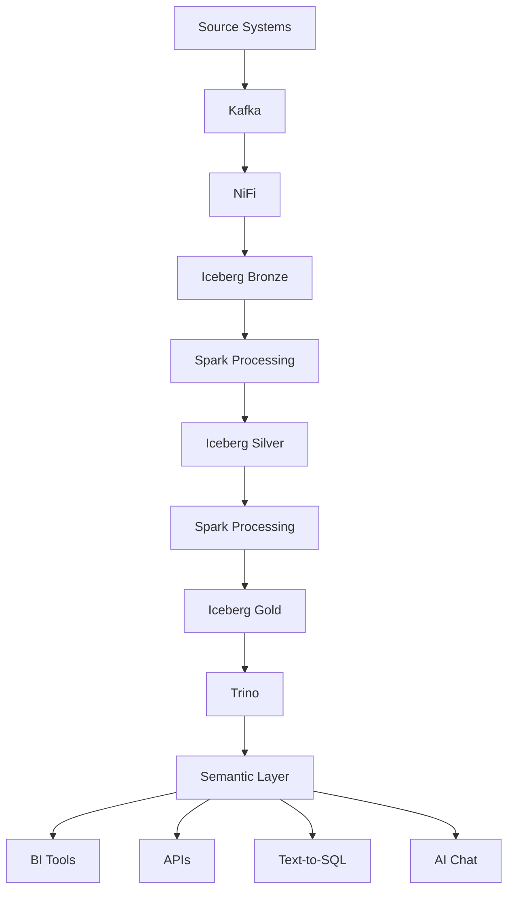
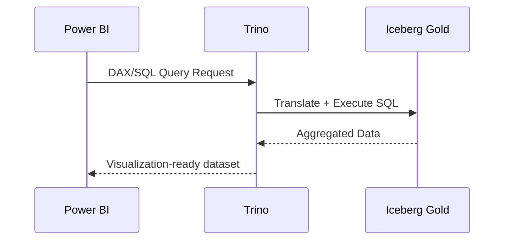
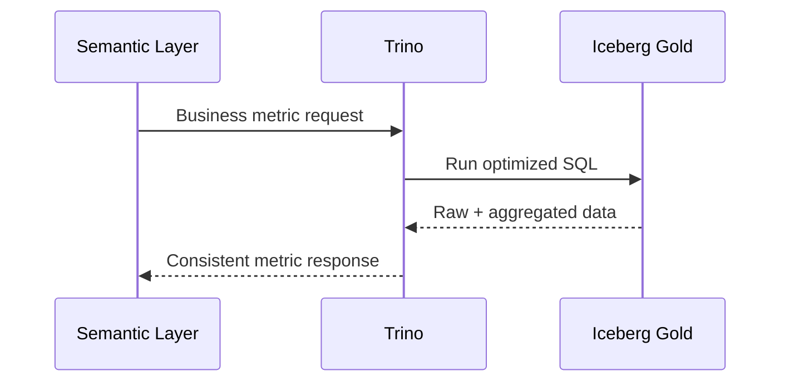
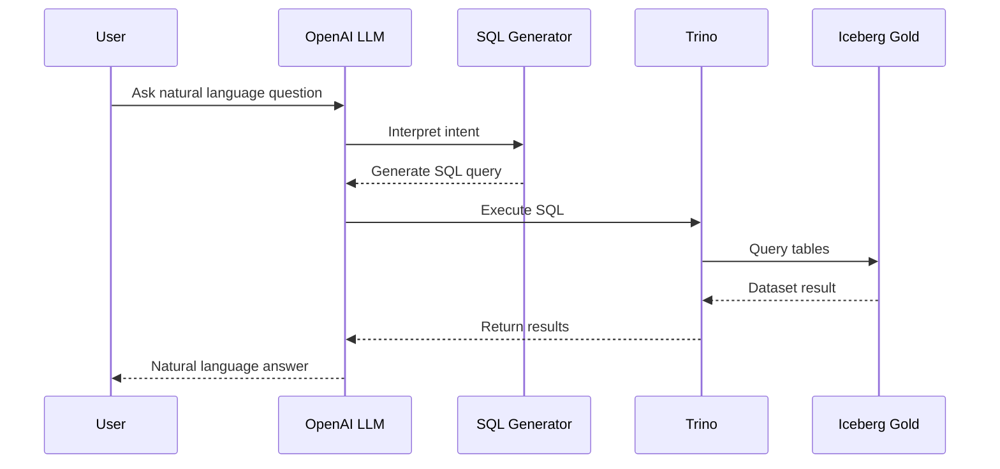
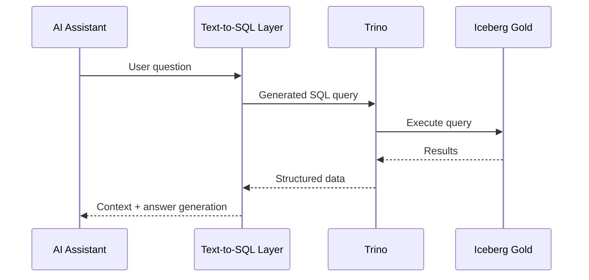
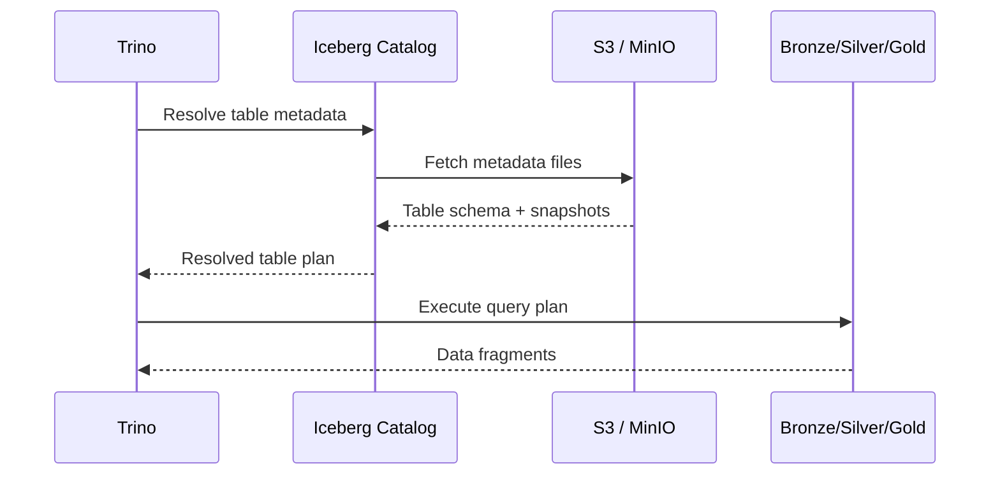

## Overview

Trino is the central query engine of the DataMind AI platform.

Its primary role is to provide fast, distributed SQL access to curated business datasets stored in Apache Iceberg.

Trino serves as the execution layer for:

- Power BI Dashboards
- Business Analytics
- Semantic Layer
- Text-to-SQL
- AI Assistant
- External APIs
# Trino Architecture and Query Layer (Sequence-Based View)  
  
## Overview  
  
Trino is the central query engine of the DataMind AI platform.  
  
It provides distributed SQL access over Iceberg Gold data and acts as the execution layer for analytics, BI, and AI workloads.  
  
---  
  
# SQL Query Execution Flow  
  

Spark = Build Data  Trino = Query Data

# Responsibilities

## SQL Query Execution

Trino executes analytical SQL queries against Iceberg tables.

# Power BI Integration

Benefits:

- Fast dashboard performance
- Centralized query engine
- Consistent business metrics
- Reduced direct storage access

# Semantic Layer Backend

# Text-to-SQL Execution Engine

# AI Assistant Query Flow

# # Iceberg Catalog Resolution Flow

# Summary

Trino acts as a **query execution layer only**, responsible for:

- SQL execution
- BI query serving
- Semantic layer access
- Text-to-SQL execution
- AI-assisted analytics
- Secure data access over Iceberg

It does NOT perform ingestion, streaming, or storage operations.