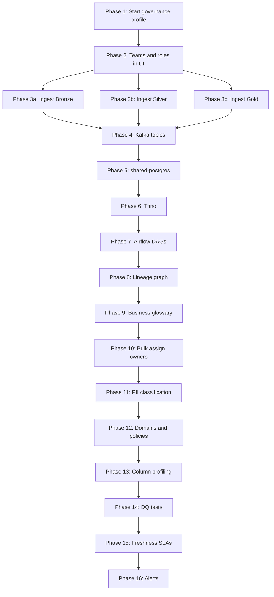

# OpenMetadata Implementation Plan — DataMind AI
**Version**: 2.0 | **Aligned to project state as of June 2026**

> [!IMPORTANT]
> The OpenMetadata infra (MySQL, Elasticsearch, migrate, server, ingestion containers) is **already in `docker-compose.yml`** under the `governance` profile. `openmetadata.env` is configured. The work starts at **Phase 2**.

---

## Current State Snapshot

| Component | Status |
|---|---|
| OM Docker services (mysql, es, server, ingestion) | ✅ Defined in `docker-compose.yml` |
| `governance/openmetadata.env` | ✅ Configured (MySQL, ES, auth, Airflow link) |
| `governance/ingestion-workflows/` | ❌ Empty — all YAML ingestion configs needed |
| `governance/tests/` | ❌ Empty — all DQ test suites needed |
| Bronze tables (9) | ✅ Defined in arch, NiFi writes them |
| Silver tables (13) | ✅ Spark jobs exist in `spark/jobs/bronze_to_silver/` |
| Gold tables (9) | ✅ Spark jobs in `spark/jobs/silver_to_gold/marts/` |
| Airflow DAGs | ✅ `bronze_to_silver_dag.py`, `silver_to_gold_dag.py` |
| Kafka topics (9) | ✅ Schema Registry at `schema-registry:8081` |
| Trino | ✅ Running on port 8085 → internal `trino:8080` |
| Great Expectations gateway | ✅ Service defined, no suites yet |

---

## Phase 1 — Start the Governance Profile (SKIP IF ALREADY DONE)

> [!NOTE]
> Only needed if the `governance` profile has not been started yet. All services are already defined.

```bash
# From project root
docker compose --profile governance up -d

# Verify all 5 OM containers are healthy
docker compose ps | grep openmetadata
```

**Expected containers running:**
- `openmetadata-mysql` (internal only)
- `openmetadata-elasticsearch` (internal only)
- `openmetadata-migrate` (one-shot, exits 0)
- `openmetadata-server` → UI at http://localhost:8585
- `openmetadata-ingestion` → embedded Airflow at http://localhost:8080

**First login:** `admin / admin` → change password immediately.

---

## Phase 2 — Create Org Structure in OM UI

**Dependency:** Phase 1 complete

### Teams to Create
| Team | Purpose | Assets to Own |
|---|---|---|
| `data-engineering` | Platform infra team | All Bronze tables, Airflow DAGs, Spark pipelines |
| `analytics` | BI / reporting team | Gold tables, semantic layer |
| `data-governance` | Stewards | Policies, glossary, PII classification |

### Roles to Assign
- `Data Consumer` — read-only analytics users
- `Data Steward` — can edit descriptions, tags, glossary links
- `Data Engineer` — full edit on pipelines and schemas

---

## Phase 3 — Connect Iceberg/Nessie Catalog (Bronze + Silver + Gold)

**Files to create:**
- `governance/ingestion-workflows/iceberg-bronze.yaml`
- `governance/ingestion-workflows/iceberg-silver.yaml`
- `governance/ingestion-workflows/iceberg-gold.yaml`

### iceberg-bronze.yaml
```yaml
source:
  type: Iceberg
  serviceName: datamind-iceberg-bronze
  serviceConnection:
    config:
      type: Iceberg
      catalog:
        name: nessie
        connection:
          type: IcebergNessieCatalog
          catalogURL: http://nessie:19120/api/v1
          warehouseLocation: s3://warehouse/
          configProperties:
            s3.endpoint: http://minio:9000
            s3.access-key-id: minioadmin
            s3.secret-access-key: minioadmin123
            s3.path-style-access: "true"
  sourceConfig:
    config:
      type: DatabaseMetadata
      databaseFilterPattern:
        includes:
          - "bronze"
sink:
  type: metadata-rest
  config: {}
workflowConfig:
  openMetadataServerConfig:
    hostPort: http://openmetadata-server:8585/api
    authProvider: openmetadata
    securityConfig:
      jwtToken: "<OM_INGESTION_BOT_JWT>"
```

### iceberg-silver.yaml
Same structure as bronze, replace:
- `serviceName: datamind-iceberg-silver`
- `databaseFilterPattern.includes: ["silver"]`

### iceberg-gold.yaml
Same structure, replace:
- `serviceName: datamind-iceberg-gold`
- `databaseFilterPattern.includes: ["gold"]`

### Run Ingestion
```bash
docker exec -it openmetadata-ingestion bash
metadata ingest -c /path/to/iceberg-bronze.yaml
metadata ingest -c /path/to/iceberg-silver.yaml
metadata ingest -c /path/to/iceberg-gold.yaml
```

**Expected result after ingestion:**
- All 9 Bronze tables registered with schema + partition info
- All 13 Silver tables registered
- All 9 Gold tables registered (customer_360, daily_revenue, etc.)

---

## Phase 4 — Connect Kafka Topics

**File to create:** `governance/ingestion-workflows/kafka-topics.yaml`

```yaml
source:
  type: Kafka
  serviceName: datamind-kafka
  serviceConnection:
    config:
      type: Kafka
      bootstrapServers: kafka:29092
      schemaRegistryURL: http://schema-registry:8081
  sourceConfig:
    config:
      type: MessagingMetadata
      topicFilterPattern:
        includes:
          - customer_topic
          - calls_topic
          - sms_topic
          - data_usage_topic
          - network_metrics_topic
          - payments_topic
          - recharge_topic
          - roaming_topic
          - tickets_topic
sink:
  type: metadata-rest
  config: {}
workflowConfig:
  openMetadataServerConfig:
    hostPort: http://openmetadata-server:8585/api
    authProvider: openmetadata
    securityConfig:
      jwtToken: "<OM_INGESTION_BOT_JWT>"
```

**Expected result:** All 9 topics registered, Avro schemas pulled from Schema Registry.

---

## Phase 5 — Connect PostgreSQL (shared-postgres)

**File to create:** `governance/ingestion-workflows/postgres-shared.yaml`

```yaml
source:
  type: Postgres
  serviceName: datamind-postgres
  serviceConnection:
    config:
      type: Postgres
      username: root
      password: "<POSTGRES_ROOT_PASSWORD from .env>"
      hostPort: shared-postgres:5432
  sourceConfig:
    config:
      type: DatabaseMetadata
      databaseFilterPattern:
        includes:
          - nessie_db
          - airflow_db
sink:
  type: metadata-rest
  config: {}
workflowConfig:
  openMetadataServerConfig:
    hostPort: http://openmetadata-server:8585/api
    authProvider: openmetadata
    securityConfig:
      jwtToken: "<OM_INGESTION_BOT_JWT>"
```

---

## Phase 6 — Connect Trino Query Engine

**File to create:** `governance/ingestion-workflows/trino-query-engine.yaml`

```yaml
source:
  type: Trino
  serviceName: datamind-trino
  serviceConnection:
    config:
      type: Trino
      username: admin
      hostPort: trino:8080
      catalog: iceberg
  sourceConfig:
    config:
      type: DatabaseMetadata
sink:
  type: metadata-rest
  config: {}
workflowConfig:
  openMetadataServerConfig:
    hostPort: http://openmetadata-server:8585/api
    authProvider: openmetadata
    securityConfig:
      jwtToken: "<OM_INGESTION_BOT_JWT>"
```

> [!TIP]
> Connecting Trino also enables usage stats — which tables are queried most, by whom. Run a separate QueryLog ingestion workflow after baseline is established.

---

## Phase 7 — Register Airflow DAGs (Pipeline Metadata)

**File to create:** `governance/ingestion-workflows/airflow-pipelines.yaml`

```yaml
source:
  type: Airflow
  serviceName: datamind-airflow
  serviceConnection:
    config:
      type: Airflow
      hostPort: http://openmetadata-ingestion:8080
      connection:
        type: Backend
  sourceConfig:
    config:
      type: PipelineMetadata
sink:
  type: metadata-rest
  config: {}
workflowConfig:
  openMetadataServerConfig:
    hostPort: http://openmetadata-server:8585/api
    authProvider: openmetadata
    securityConfig:
      jwtToken: "<OM_INGESTION_BOT_JWT>"
```

**DAGs that will be registered:**
- `bronze_to_silver_dag` → Pipeline entity in OM
- `silver_to_gold_dag` → Pipeline entity in OM

> [!NOTE]
> The `openmetadata-ingestion` container runs an embedded Airflow (standalone). Your project DAGs (`airflow/dags/`) are mounted into the main `airflow-scheduler` container, NOT the OM-embedded one. For now, register the OM-embedded Airflow and trigger ingestion runs from OM UI. Later, install `openmetadata-ingestion[airflow]` into your main Airflow containers for true lineage capture from your actual DAGs.

---

## Phase 8 — Build End-to-End Lineage Graph

### Automated Lineage Sources
| Source | Captures |
|---|---|
| Airflow plugin (phase 7) | DAG → table (which DAG reads/writes which table) |
| Iceberg connector | Table snapshots, schema versions |
| Trino connector | Query-level lineage |

### Manual Lineage via API (Kafka → Bronze gap)
```bash
curl -X PUT http://localhost:8585/api/v1/lineage \
  -H "Authorization: Bearer <JWT>" \
  -H "Content-Type: application/json" \
  -d '{
    "edge": {
      "fromEntity": {"type": "topic", "fqn": "datamind-kafka.customer_topic"},
      "toEntity":   {"type": "table",  "fqn": "datamind-iceberg-bronze.bronze.customers"}
    }
  }'
```
Repeat for all 9 topic → bronze table pairs.

**Full lineage chain to achieve:**
```
Kafka Topic
  → [NiFi] → Bronze Table
  → [bronze_to_silver_dag / Spark] → Silver Table
  → [silver_to_gold_dag / Spark]  → Gold Table
  → [Trino] → Semantic Layer / Text-to-SQL
```

---

## Phase 9 — Business Glossary

### DataMind Telecom Glossary Terms

| Term | Definition | Linked Columns |
|---|---|---|
| Customer Lifetime Value (CLV) | Total revenue expected from a customer over their relationship | `gold.customer_360.customer_lifetime_value` |
| CDR (Call Detail Record) | Record of a single voice call (duration, QoS, charge) | `bronze.calls.*`, `silver.billing_calls.*` |
| ARPU | Average Revenue Per User — SUM(revenue) / COUNT(DISTINCT customer) | `gold.daily_revenue.*` |
| Churn Score | ML-derived probability (0–1) of customer leaving in 30 days | `gold.customer_360.churn_score` |
| QoS Score | Composite network quality score (MOS, jitter, latency, packet loss) | `gold.network_performance.network_health_score` |
| Roaming Session | Data/voice session on a foreign operator network | `silver.roaming_events.*` |
| Network KPI | Key Performance Indicator for cell site health | `gold.network_performance.*` |
| Payment Success Rate | % of payment transactions completed successfully | `gold.payment_analytics.success_rate` |
| MSISDN | Mobile Station International Subscriber Directory Number (phone number) | `silver.*.phone_number` |

```bash
# Create glossary
curl -X PUT http://localhost:8585/api/v1/glossaries \
  -H "Authorization: Bearer <JWT>" \
  -H "Content-Type: application/json" \
  -d '{"name": "DataMind Telecom Glossary", "description": "Business terms for DataMind AI telecom platform"}'
```

---

## Phase 10 — Assign Owners to All Assets (Bulk Script)

**Script to create:** `governance/scripts/bulk_assign_owners.py`

```python
"""Bulk assigns team ownership to all registered assets."""
import requests

OM_HOST = "http://localhost:8585/api/v1"
HEADERS = {"Authorization": "Bearer <JWT>", "Content-Type": "application/json"}

# Bronze + Silver → data-engineering team
BRONZE_TABLES = [
    "datamind-iceberg-bronze.bronze.customers",
    "datamind-iceberg-bronze.bronze.calls",
    "datamind-iceberg-bronze.bronze.sms",
    "datamind-iceberg-bronze.bronze.data_usage",
    "datamind-iceberg-bronze.bronze.network_metrics",
    "datamind-iceberg-bronze.bronze.payments",
    "datamind-iceberg-bronze.bronze.recharge",
    "datamind-iceberg-bronze.bronze.roaming",
    "datamind-iceberg-bronze.bronze.tickets",
]

# Gold → analytics team
GOLD_TABLES = [
    "datamind-iceberg-gold.gold.customer_360",
    "datamind-iceberg-gold.gold.daily_revenue",
    "datamind-iceberg-gold.gold.customer_usage_daily",
    "datamind-iceberg-gold.gold.payment_analytics",
    "datamind-iceberg-gold.gold.recharge_analytics",
    "datamind-iceberg-gold.gold.roaming_analytics",
    "datamind-iceberg-gold.gold.network_performance",
    "datamind-iceberg-gold.gold.support_analytics",
    "datamind-iceberg-gold.gold.fraud_monitoring",
]
```

---

## Phase 11 — PII Classification

### Columns to Tag

| Table | Column | PII Type |
|---|---|---|
| `bronze.customers` | `phone_number`, `name`, `national_id`, `address` | PII.Sensitive |
| `silver.crm_customer_registrations` | `phone_number`, `customer_id` | PII.Sensitive |
| `silver.billing_calls` | `caller_phone_number`, `receiver_phone_number` | PII.Sensitive |
| `silver.billing_sms` | `sender_phone_number`, `receiver_phone_number`, `message_body` | PII.Sensitive |
| `silver.payments` | `customer_id`, `phone_number`, `invoice_number` | PII.Sensitive |
| `gold.customer_360` | `phone_number`, `customer_id` | PII.Sensitive |

### Auto-classification Config (add to each iceberg YAML)
```yaml
# Under sourceConfig.config:
autoClassification:
  enabled: true
  classifiers:
    - type: PIIClassifier
      config:
        sensitiveTagFQN: "PII.Sensitive"
        columnPatterns:
          - ".*phone.*"
          - ".*national_id.*"
          - ".*address.*"
```

---

## Phase 12 — Data Domains and Policies

### Domains (create in OM UI)
| Domain | Assets | Steward |
|---|---|---|
| CRM & Customer | `silver.crm_*`, `gold.customer_360`, `customer_topic` | `data-governance` |
| Billing | `silver.billing_*`, `gold.daily_revenue`, `calls_topic`, `sms_topic` | `data-governance` |
| Network Operations | `silver.network_*`, `silver.qos_*`, `gold.network_performance` | `data-engineering` |
| Payments & Recharge | `silver.payments`, `silver.recharges`, `gold.payment_analytics` | `data-governance` |
| International Roaming | `silver.roaming_events`, `gold.roaming_analytics`, `roaming_topic` | `analytics` |
| Customer Support | `silver.support_*`, `silver.complaints`, `gold.support_analytics` | `analytics` |

---

## Phase 13 — Column Profiling on All Layers

**Files to create:**
- `governance/ingestion-workflows/profiler-bronze.yaml`
- `governance/ingestion-workflows/profiler-silver.yaml`
- `governance/ingestion-workflows/profiler-gold.yaml`

```yaml
# profiler-gold.yaml (example)
source:
  type: IcebergProfiler
  serviceName: datamind-iceberg-gold
  sourceConfig:
    config:
      type: Profiler
      timeoutSeconds: 300
      databaseFilterPattern:
        includes: ["gold"]
processor:
  type: orm-profiler
  config:
    tableConfig:
      - fullyQualifiedName: gold.customer_360
        profileSample: 100
        columnConfig:
          - columnName: churn_score
          - columnName: customer_lifetime_value
          - columnName: total_revenue
sink:
  type: metadata-rest
  config: {}
workflowConfig:
  openMetadataServerConfig:
    hostPort: http://openmetadata-server:8585/api
    authProvider: openmetadata
    securityConfig:
      jwtToken: "<OM_INGESTION_BOT_JWT>"
```

**Captures:** row counts, null rates, distinct values, min/max/mean, value distributions.

---

## Phase 14 — Data Quality Tests per Domain

**File to create:** `governance/tests/gold-dq-test-suites.yaml`

```yaml
testSuite:
  name: gold-datamind-tests

testCases:
  - name: customer_id_not_null
    entityLink: "<#E::table::datamind-iceberg-gold.gold.customer_360::columns::customer_id>"
    testDefinition: columnValuesToBeBetween
    parameterValues:
      - name: minValue
        value: 1

  - name: churn_score_between_0_and_1
    entityLink: "<#E::table::datamind-iceberg-gold.gold.customer_360::columns::churn_score>"
    testDefinition: columnValuesToBeBetween
    parameterValues:
      - name: minValue
        value: 0
      - name: maxValue
        value: 1

  - name: call_duration_non_negative
    entityLink: "<#E::table::datamind-iceberg-silver.silver.billing_calls::columns::call_duration_seconds>"
    testDefinition: columnValuesToBeBetween
    parameterValues:
      - name: minValue
        value: 0

  - name: roaming_cost_not_negative
    entityLink: "<#E::table::datamind-iceberg-silver.silver.roaming_events::columns::roaming_charges>"
    testDefinition: columnValuesToBeBetween
    parameterValues:
      - name: minValue
        value: 0

  - name: daily_revenue_positive
    entityLink: "<#E::table::datamind-iceberg-gold.gold.daily_revenue::columns::total_revenue>"
    testDefinition: columnValuesToBeBetween
    parameterValues:
      - name: minValue
        value: 0
```

---

## Phase 15 — Freshness SLAs on Gold Tables

Based on existing Airflow schedule (`silver_to_gold_dag`):

| Gold Table | SLA Target |
|---|---|
| `gold.customer_360` | Updated by 08:00 UTC daily |
| `gold.daily_revenue` | Updated by 06:00 UTC daily |
| `gold.network_performance` | Updated by 06:00 UTC daily |
| `gold.payment_analytics` | Updated by 06:00 UTC daily |
| `gold.support_analytics` | Updated by 08:00 UTC daily |

Configure in OM UI: Table → **Profiler** → **Data SLA** → set freshness schedule.

---

## Phase 16 — Alerts and Webhooks

**Configure in OM UI → Settings → Alerts:**

| Alert | Trigger | Destination |
|---|---|---|
| DQ Test Failure | Any gold DQ test fails | Slack / Email |
| Schema Change on Gold | Column added/removed in Gold layer | analytics team owner |
| New PII Column | Auto-classifier finds new PII column | data-governance team |
| Freshness SLA Breach | Gold table not updated by SLA deadline | data-engineering + analytics |

---

## Execution Flow



---

## Files to Create (Checklist)

| File | Phase | Status |
|---|---|---|
| `governance/ingestion-workflows/iceberg-bronze.yaml` | 3 | ❌ TODO |
| `governance/ingestion-workflows/iceberg-silver.yaml` | 3 | ❌ TODO |
| `governance/ingestion-workflows/iceberg-gold.yaml` | 3 | ❌ TODO |
| `governance/ingestion-workflows/kafka-topics.yaml` | 4 | ❌ TODO |
| `governance/ingestion-workflows/postgres-shared.yaml` | 5 | ❌ TODO |
| `governance/ingestion-workflows/trino-query-engine.yaml` | 6 | ❌ TODO |
| `governance/ingestion-workflows/airflow-pipelines.yaml` | 7 | ❌ TODO |
| `governance/ingestion-workflows/profiler-bronze.yaml` | 13 | ❌ TODO |
| `governance/ingestion-workflows/profiler-silver.yaml` | 13 | ❌ TODO |
| `governance/ingestion-workflows/profiler-gold.yaml` | 13 | ❌ TODO |
| `governance/tests/gold-dq-test-suites.yaml` | 14 | ❌ TODO |
| `governance/scripts/bulk_assign_owners.py` | 10 | ❌ TODO |

---

## Key Corrections from Original Plan

| Original Plan | Actual Reality |
|---|---|
| "Deploy OM via Docker Compose (wget)" | OM already in `docker-compose.yml` — skip |
| "Install Airflow OM plugin via pip" | OM ships its **own embedded Airflow** in `openmetadata-ingestion:1.5.0` |
| "Nessie catalogURL" | Nessie runs at port 19120, internal hostname `nessie` — verify API version (v1 vs v2) |
| "8 bronze tables" | **9 bronze tables** — includes `network_metrics` |
| "6 Gold tables" | **9 Gold tables** — also has `customer_usage_daily`, `recharge_analytics`, `support_analytics`, `fraud_monitoring` |
| "Connect PostgreSQL service" | It's `shared-postgres` — single Postgres for both Nessie + Airflow |
| "GE integration active" | GE gateway service exists but **no suites defined** — build GE expectations first |
| Airflow port | Main Airflow webserver: 8083, OM embedded Airflow: 8080 (inside `openmetadata-ingestion`) |
